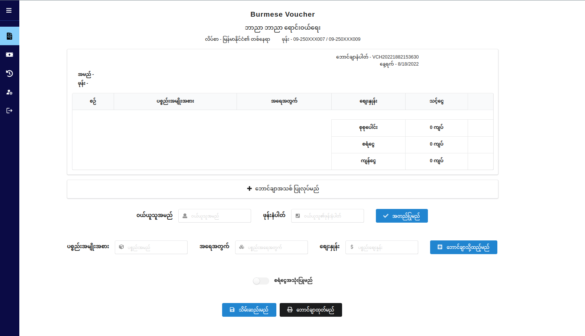
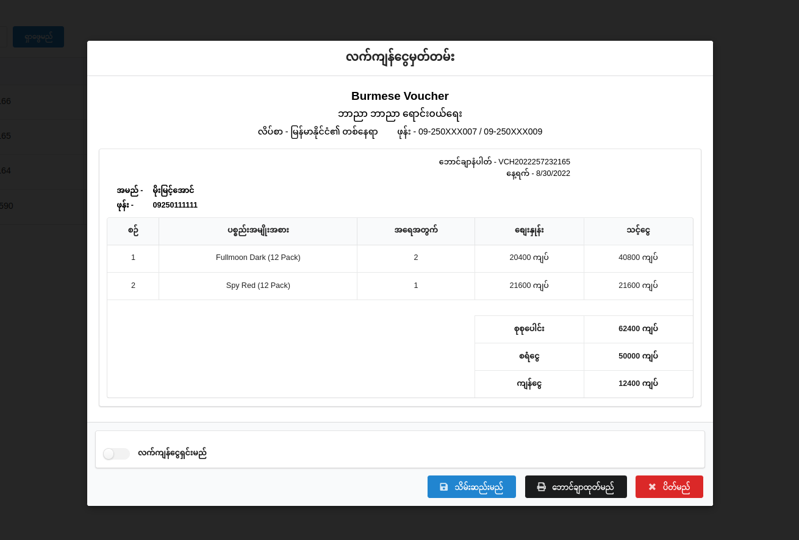

# Burmese Voucher

-   Cloud base simple sale voucher system for Burmese.
-   https://burmesevoucher.netlify.app/

#### Screenshots

<table> 
     <tr> 
          <td>  </td>
          <td> </td>
     </tr>
</table>

#### Download or Clone the repository

-   Run this command on terminal or [Download here](https://github.com/pyae-sone-maung/Burmese-Voucher/archive/refs/heads/main.zip).

```
git clone https://github.com/pyae-sone-maung/Google-Authentication-Node.js-App.git
```

-   Install dependencies

```
cd Burmese-Voucher
npm install
```

-   Run the project

```
npm start
```

#### Guide

-   Find .env file in root and configure your api
